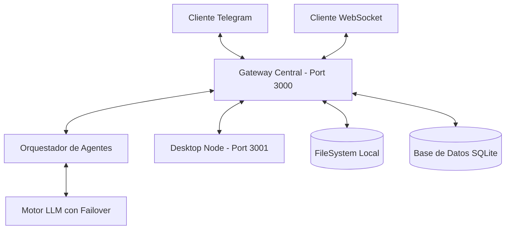

# 🏗️ Arquitectura Técnica de Nexo

## 🧩 Diagrama de Componentes

Nexo utiliza una arquitectura distribuida basada en eventos para garantizar que el sistema sea lo más ligero posible mientras mantiene una alta capacidad de respuesta.



## ⚙️ Especificaciones del Sistema

### 1. Gateway Central (`src/core/gateway.ts`)
- **Responsabilidad**: Punto de entrada único para todas las señales. Maneja el enrutamiento de mensajes entre canales y nodos.
- **Protocolo**: WebSockets para tiempo real, HTTP para webhooks externos.

### 2. Motor LLM con Failover Multi-Provider
- **Primario**: Groq (Llama-3-70b/8b) para baja latencia (<500ms).
- **Secundario**: OpenRouter (Claude 3.5 Sonnet / GPT-4o) para tareas complejas o cuando Groq alcanza rate limits.
- **Lógica**: Si el proveedor A devuelve error o tarda más de 10s, el sistema reintenta automáticamente con el proveedor B manteniendo el historial exacto.

### 3. Persistencia de Datos (SQLite + FS)
Nexo combina la flexibilidad del sistema de archivos con la robustez de una base de datos relacional:
- **SQLite (`database.db`)**: Almacena datos estructurados como la configuración de usuarios, logs de eventos de alta frecuencia y relaciones entre agentes.
- **FileSystem (`Sessions/`)**: Los hilos de conversación se guardan como archivos JSON independientes para facilitar la portabilidad y la inspección manual.

### 4. Desktop Node (`src/nodes/desktop-node.ts`)
Para aumentar la seguridad, las tareas que requieren acceso directo al hardware (terminal, pantalla, archivos) se ejecutan en un proceso separado que se conecta al Gateway.
- **Handshake**: Requiere un `NEXO_NODE_TOKEN`.
- **Sandbox**: Las operaciones están restringidas por un motor de reglas de seguridad.

### 5. Sentinel (`src/security/sentinel.ts`)
Un \"watchdog\" independiente que escanea los logs de auditoría en busca de:
- Intención de ejecución de comandos prohibidos (`rm -rf`, `sudo`).
- Accesos desde IPs no autorizadas.
- Anomalías en el comportamiento de los agentes.

---

## 📂 Directorios del Proyecto
```text
Asistente-Personal-Nexo/
├── .nexo_data/          # Almacén de datos persistentes (DB, Sesiones, Logs)
├── src/
│   ├── core/            # Núcleo del Gateway y Tipos
│   ├── engines/         # Lógica de LLM y Proveedores
│   ├── channels/        # Telegram y WebSockets
│   ├── nodes/           # Clientes locales (Desktop Node)
│   ├── security/        # Sentinel y Allowlist
│   └── agents/          # Lógica específica de sub-agentes
└── scripts/             # Utilidades de mantenimiento
```
