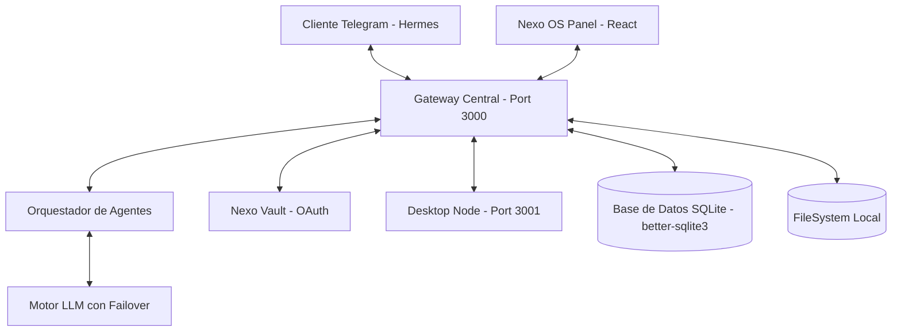

# 🏗️ Arquitectura Técnica de Nexo

## 🧩 Diagrama de Componentes

Nexo utiliza una arquitectura distribuida basada en eventos para garantizar que el sistema sea lo más ligero posible mientras mantiene una alta capacidad de respuesta.



## ⚙️ Especificaciones del Sistema

### 1. Gateway Central (Hermes)

- **Responsabilidad**: Punto de entrada único orquestado con **grammY**. Maneja el ciclo de vida de los mensajes y la persistencia de sesiones.
- **Protocolo**: Webhooks con validación de tokens secretos, WebSockets para el panel.

### 2. Motor LLM (Brain)

- **Primario**: Groq (Llama-3.3-70b/8b) para baja latencia.
- **Secundario**: OpenRouter (Claude 3.5 Sonnet / GPT-4o).
- **Control**: Dashboard de monitoreo de latencia y failover proactivo.

### 3. Persistencia Soberana (SQLite)

- **Motor**: `better-sqlite3` para acceso síncrono ultra-rápido.
- **Schema**: Tablas unificadas para `sessions` y `messages`.
- **Privacidad**: 100% Local, eliminando la necesidad de Firestore para datos sensibles.

### 4. Nexo Vault (OAuth)

- **Seguridad**: Sistema de almacenamiento cifrado para gestionar flujos de autenticación con servicios de Google, GitHub, etc.
- **Aislamiento**: Los tokens nunca salen de la máquina local.

### 5. Sentinel & Auditoría

- **Sentinel**: Watchdog independiente que escanea logs en tiempo real detectando anomalías y escaladas de privilegios.
- **Context Envelope**: Marcado de cada mensaje con metadata de origen para trazabilidad forense.

---

## 📂 Directorios del Proyecto

```text
Asistente-Personal-Nexo/
├── .nexo_data/          # Almacén de datos persistentes (DB, Sesiones, Logs)
├── src/
│   ├── core/            # Núcleo del Gateway y Tipos
│   ├── engines/         # Lógica de LLM y Proveedores
│   ├── channels/        # Telegram y WebSockets
│   ├── nodes/           # Clientes locales (Desktop Node)
│   ├── security/        # Sentinel y Allowlist
│   └── agents/          # Lógica específica de sub-agentes
└── scripts/             # Utilidades de mantenimiento
```
